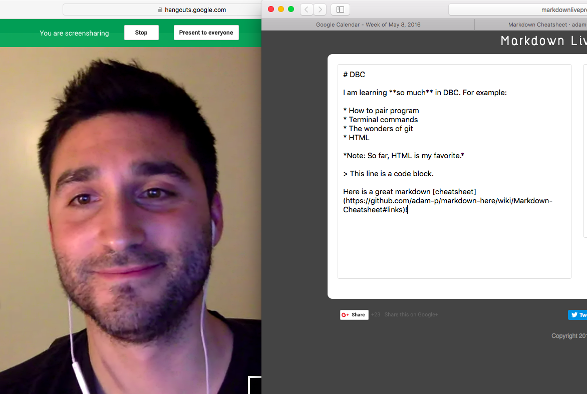

# DBC

I am learning **so much** in DBC. For example:

* How to pair program
* Terminal commands
* The wonders of git
* HTML

*Note: So far, git is my favorite.*

> This line is a code block.

Here is a great markdown [cheatsheet](https://github.com/adam-p/markdown-here/wiki/Markdown-Cheatsheet#links)!

